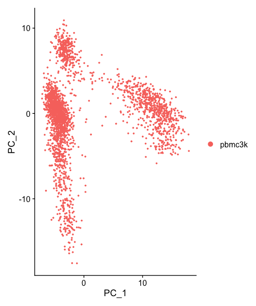
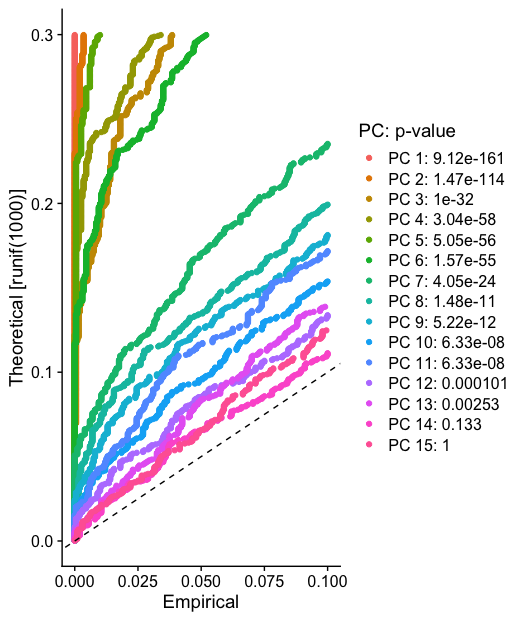
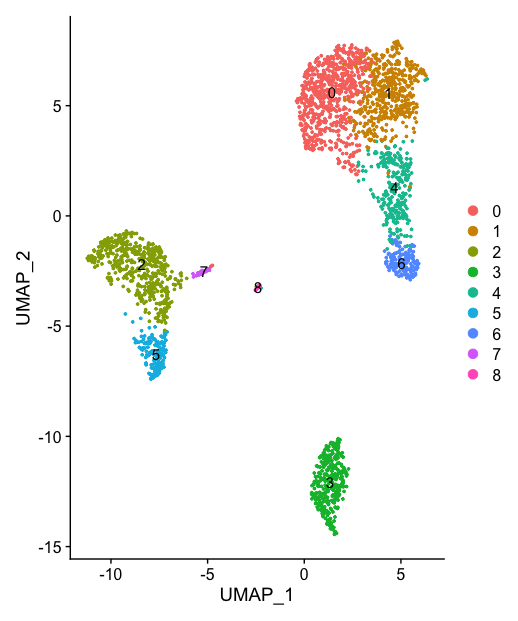
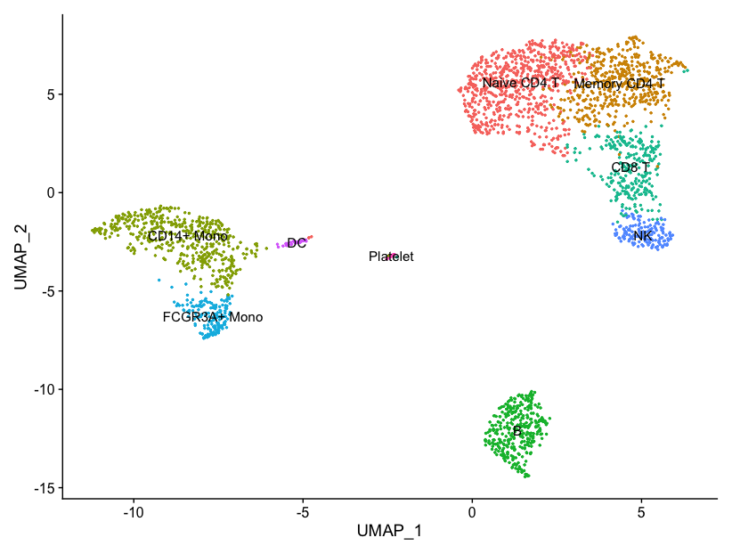

# Single-cell RNASeq Analysis - Peripheral Blood Mononuclear Cells
## 10X Genomics - Seurat Tutorial

**Objective:** Utilize the Seurat R Toolkit to analyze PBMC to identify distinct cell populations and explore differential expression

**[Data Source](https://cf.10xgenomics.com/samples/cell/pbmc3k/pbmc3k_filtered_gene_bc_matrices.tar.gz)**

## Step 1: Read Input Data
- `Read10x` function reads in the output of the 10x [cellranger](https://support.10xgenomics.com/single-cell-gene-expression/software/pipelines/latest/what-is-cell-ranger) pipeline

- Dependencies required: dplyr, Seurat, Matrix

## Step 2: Standard Pre-Processing
### Evaluate QC Metrics
1. Use standard quality control (QC) metrics to clean the data. Remove low-quality cells, empty droplet, and cell multiplets
2. Count total number of molecules within a cell 
3. Percentage of reads from mitochondrial genome (indicative of low quality/dying cells)

**Violin Plot of Features, Counts, and Mitochondrial Percentage**

**Compare Features via ScatterPlot**

### Normalize Data
Global-scaling normalization method `LogNormalize`used to normalize the feature expression measurements for each cell
log(total expression x scale factor (10,000 by default))

### Perform Feature Selection
Minimize biological signal-to-noise ratio via `FindVariableFeatures`

### Scale Data
Linear transformation using `ScaleData`

## Step 3: Linear Dimensional Reduction
- Principle component Analysis (PAC) methodology applied here

### Determine the dimensionality of the dataset

## Step 4: Clustering via K-nearest Neighbors
Seurat provides a `FindNeighbors`and `FindClusters`to determine clusters based on similar feature expression patterns 

### Non-linear dimensional reduction

### Differential Expression Testing

Labeled UMAP with Cell types based on cell-specific markers

